# `linalg-checker`

Lightweight checking for undergraduate-level finite-dimensional linear algebra

---

## Clarifications wrt scope

- Clean-room implementation. No Leantutor IP used.
  - Corollary: There is overlap and divergence from our existing implementation.
- This is a prototype. Just because I worked on it doesn't mean I think we should use it.
  - Corollary: Divergence from our existing implementation should be fine. It is just experimentation.
  - LLMs have created a reversal: ideas are costly and code is cheap. Green-field prototypes make more sense than ever.
- There is an interplay between HCI and algorithms aspects in terms of motivation and determination of what is possible, but potential HCI and algorithms contributions must be strong enough to separately stand on their own

<!-- Happy to discuss copyright offline. -->

---

## Original motivation (perhaps naive)

- When people write proofs, they usually assert **universally quantified statements** $\forall n_1, n_2, \dots, x_1, x_2, \dots \,, \phi(n_1, n_2, \dots, x_1, x_2, \dots)$
- **Naively,** I said: "existentially quantified statements are easy to prove! **Just** fuzz and exhibit a witness like software testing folks do"
- Proving student-written claims true is an unsatisfactory solution on its own
  - It costs latency/$$$ to try to **prove falsehoods**

---

## Original motivation (continued)

- Problem 1: Witnesses involve real numbers?
  - Naive answer: Fuzz over $\mathbb Q$
  - Other answer: Fuzz over the closure of $\mathbb Q$ under $\sqrt \cdot$
- Problem 2: Hypotheses (e.g. equational constraints) will be satisfied w.p. 0?
  - Set of witnesses has measure 0?
  - Fuzzing only checks points

<!-- todo: visualize points floating above/below lower-dimensional manifold -->

---

## Actual motivation

<!-- - Disproving is naturally expressed as deciding an **existentially quantified formula** $\exists x_1, x_2, \dots \, \neg\phi(x_1, x_2, \dots)$ -->
- *Cost:* **There will always be "easy" problems** for which symbolic/non-neural algorithms are **much** cheaper/more responsive than LLMs will likely ever be
  - At the undergrad level, **we are interested in "easy" problems**
    - maybe even decidable!
    - Or translatable or "closely" under/over-approximable by decidable problems
- Other reasons:
  - *Feasibility:* 100% correctness is usually not the most important goal in education
    - Partial support for inputs, ill-defined scope of support, under/overapproximation, etc. are all fair game.
  - *Determinism/alignment:* Tool use vs. prompt engineering can both increase determinism & alignment, and each has pros and cons

**What if our system based on SoTA tech is 10 years behind SoTA performance?**

---
layout: two-cols
class: proof-example
---

## Example (QF_NRA): Squaring nonnegative numbers is monotone

*Timing: 20.9 ms*

<!-- Source: linalg-checker/examples/validate_argument/successes.output.md — Squaring nonnegative numbers is monotone -->

Given:

- $x \in \mathbb{R}$
- $y \in \mathbb{R}$
- $0 \le x$
- $x \le y$

WTS $x^{2} \le y^{2}$

✅ verified

This follows from the following facts:

- $x^{2} \le y^{2}$

::right::

1. $0 \le y$

   

   
✅ verified

   This follows from the following facts:

   - $0 \le x$
   - $x \le y$
   

2. $0 \le y - x$

   

   
✅ verified

   This follows from the following facts:

   - $x \le y$
   

3. $0 \le \left(y - x\right) \left(x + y\right)$

   

   
✅ verified

   This follows from the following facts:

   - $0 \le x$
   - $x \le y$
   

4. $0 \le y^{2} - x^{2}$

   

   
✅ verified

   This follows from the following facts:

   - $0 \le \left(y - x\right) \left(x + y\right)$
   

5. $x^{2} \le y^{2}$

   

   
✅ verified

   This follows from the following facts:

   - $0 \le \left(y - x\right) \left(x + y\right)$
   

---
layout: two-cols
class: proof-example
---

## Example w/ dimensions: Orthogonal matrices preserve squared length

*Timing: 37.6 ms*

<!-- Source: linalg-checker/examples/validate_argument/successes.output.md — Orthogonal matrices preserve squared length -->

Given:

- $U \in \mathbb{R}^{n \times n}$
- $x \in \mathbb{R}^{n}$
- $U^\top U = I$

WTS $\left\lVert U x \right\rVert_{2}^{2} = \left\lVert x \right\rVert_{2}^{2}$

✅ likely

No counterexamples found up to a maximum dimension of 2.

This may follow from the following facts:

- $U^\top U = I$
- $x^\top U^\top U x = x^\top I x$

::right::

1. $\left(U x\right)^\top U x = x^\top U^\top U x$

   

   
✅ likely

   No counterexamples found up to a maximum dimension of 2.

   No premises seemed necessary to show this.
   

2. $x^\top U^\top U x = x^\top I x$

   

   
✅ likely

   No counterexamples found up to a maximum dimension of 2.

   This may follow from the following facts:

   - $U^\top U = I$
   

3. $x^\top I x = x^\top x$

   

   
✅ likely

   No counterexamples found up to a maximum dimension of 2.

   No premises seemed necessary to show this.
   

---

## Types of guarantees

Solve the following problem:
- **Decide** linear algebra propositions with *bounded dimension* that can be expressed without quantifier alternation
  - i.e.: prove or disprove
- **Disprove** linear algebra propositions that can be expressed without quantifier alternation
  - requires an underapproximation that represents "a subset of the guarantee"
  - [probably about the best you can do](https://mathoverflow.net/questions/33879/decidability-of-matrix-algebra), but I should verify the proof

---

## Related work

- SMT-comp aggregates solvers that provide good support for many subsets of math (including QF_NRA). **However:**
  1. these are infrastructure, not user interfaces, and hence lack high-level constructs (span, rank, orthogonality, etc.)
      - both an HCI problem ("what high-level constructs?") and an algorithms problem ("how to lower them?")
  <!-- 1. the best-supported theories (bitvectors, arrays, etc.) focus on software/hardware more than mathematics -->
- CASes (Mathematica, Maple, [REDLOG](https://dl.acm.org/doi/pdf/10.1145/261320.261324), Magma, Sympy, SageMath, ...) are well-established and support matrix computations
  1. Unclear support for underapproximation and solver-aware lowering for high-level constructs
  1. Unclear matrix-level support for decision procedures or cex search (e.g. with CDCL solving, incremental solving)
- Optimization languages (e.g. CVX/CVXPY, YALMIP) lower high-level constructs but do not incorporate general decision procedures
- See [SC2](https://arxiv.org/html/1607.06945v1) for a vision/opinion regarding this gap

---

## Potential algorithmic contributions

- underapproximations used to produce efficiently decidable queries
  - current approach is not very creative (see <Link to="architecture" title="Architecture"/>)
- a family of standard tricks that combine to lower high-level linear algebra constructs to equisatisfiable QF queries
  - skolemization, theorem-based simplifications/operator eliminations
  - logical-polarity-dependent rewriting
    - "$A$ is invertible" &rarr; "$\exists B.\, AB = I$"
      - ($\exists$ skolemizes away; truly QF determinant-based formulation lowers to a large, high-degree QF_NRA formula)
    - "$A$ is not invertible" &rarr; "$\exists \vec{x} \neq \vec{0}.\, A\vec{x} = \vec{0}$"
    - "$\vec{x} \in \operatorname{Range}(A)$" &rarr; "$\exists \vec{y}.\, A\vec{y} = x$"
    - "$\vec{x} \notin \operatorname{Range}(A)$" &rarr; "$\exists \vec{y}.\, A^\top \vec{y} = \vec{0} \land \vec{y}^\top \vec{x} \neq 0$"
  - optimization of # variables introduced, formula size, polynomial degree, etc.

---

# Related work summary

| System family | Native matrix/vector syntax | NRA formulas with general boolean structure | Quantifiers | Solver-aware matrix lowering | QF_NRA / real-polynomial decision backend | General proposition checking |
|---|---:|---:|---:|---:|---:|---:|
| Z3 / cvc5 / SMT-RAT | no standard matrix theory; scalar/low-level theories [1](https://microsoft.github.io/z3guide/docs/theories/Arithmetic/) [2](https://cvc5.github.io/docs-ci/docs-main/theories/theories.html) [3](https://ths-rwth.github.io/smtrat/d0/da9/structsmtrat_1_1parser_1_1ArithmeticTheory.html) | yes [1](https://microsoft.github.io/z3guide/docs/theories/Arithmetic/) [2](https://cvc5.github.io/docs-ci/docs-main/theories/theories.html) [4](https://ths-rwth.github.io/smtrat/dc/dad/md__builds_ths_smt_smtrat_doc_markdown_07_using_smtrat.html) | completeness varies (CAD QE by SMT-RAT) [5](https://microsoft.github.io/z3guide/docs/logic/Quantifiers/) [6](https://cvc5.github.io/tutorials/beginners/theories.html) [4](https://ths-rwth.github.io/smtrat/dc/dad/md__builds_ths_smt_smtrat_doc_markdown_07_using_smtrat.html) | no general matrix → arithmetic lowering documented [1](https://microsoft.github.io/z3guide/docs/theories/Arithmetic/) [2](https://cvc5.github.io/docs-ci/docs-main/theories/theories.html) [3](https://ths-rwth.github.io/smtrat/d0/da9/structsmtrat_1_1parser_1_1ArithmeticTheory.html) | yes [7](https://microsoft.github.io/z3guide/docs/theories/Arithmetic/) [8](https://github.com/cvc5/cvc5/blob/main/NEWS.md) [4](https://ths-rwth.github.io/smtrat/dc/dad/md__builds_ths_smt_smtrat_doc_markdown_07_using_smtrat.html) | yes after low-level encoding, within supported fragments [1](https://microsoft.github.io/z3guide/docs/theories/Arithmetic/) [5](https://microsoft.github.io/z3guide/docs/logic/Quantifiers/) [4](https://ths-rwth.github.io/smtrat/dc/dad/md__builds_ths_smt_smtrat_doc_markdown_07_using_smtrat.html) |
| Mathematica / Maple / REDLOG | mixed: high in Mathematica/Maple; REDLOG's logic layer is scalar [9](https://reference.wolfram.com/language/guide/MatrixOperations.html) [10](https://www.maplesoft.com/support/help/view.aspx?path=RegularChains%2FSemiAlgebraicSetTools) [11](https://www.redlog.eu/) | yes [12](https://reference.wolfram.com/language/ref/Resolve.html) [13](https://www.maplesoft.com/support/help/Maple/view.aspx?path=RegularChains%2FSemiAlgebraicSetTools%2FQuantifierElimination) [11](https://www.redlog.eu/) | yes [12](https://reference.wolfram.com/language/ref/Resolve.html) [13](https://www.maplesoft.com/support/help/Maple/view.aspx?path=RegularChains%2FSemiAlgebraicSetTools%2FQuantifierElimination) [14](https://www.redlog.eu/documentation/service.php?key=rlqe) | no general matrix → real-arithmetic lowering documented; matrix algebra and QE are documented largely separately [9](https://reference.wolfram.com/language/guide/MatrixOperations.html) [12](https://reference.wolfram.com/language/ref/Resolve.html) [10](https://www.maplesoft.com/support/help/view.aspx?path=RegularChains%2FSemiAlgebraicSetTools) [13](https://www.maplesoft.com/support/help/Maple/view.aspx?path=RegularChains%2FSemiAlgebraicSetTools%2FQuantifierElimination) | yes [12](https://reference.wolfram.com/language/ref/Resolve.html) [13](https://www.maplesoft.com/support/help/Maple/view.aspx?path=RegularChains%2FSemiAlgebraicSetTools%2FQuantifierElimination) [14](https://www.redlog.eu/documentation/service.php?key=rlqe) | yes for supported scalar theories [12](https://reference.wolfram.com/language/ref/Resolve.html) [13](https://www.maplesoft.com/support/help/Maple/view.aspx?path=RegularChains%2FSemiAlgebraicSetTools%2FQuantifierElimination) [11](https://www.redlog.eu/) |
| CVX / CVXPY / YALMIP | high [15](https://cvxr.com/cvx/doc/intro.html) [16](https://cvxpy.readthedocs.io/en/latest/api_reference/cvxpy.expressions.html) [17](https://yalmip.github.io/tutorial/basics/) | restricted to modeling languages / special logical constructs [18](https://cvxr.com/cvx/doc/dcp.html) [19](https://www.cvxpy.org/version/1.4/api_reference/cvxpy.constraints.html) [20](https://yalmip.github.io/tutorial/logicprogramming) | not general first-order quantification [18](https://cvxr.com/cvx/doc/dcp.html) [19](https://www.cvxpy.org/version/1.4/api_reference/cvxpy.constraints.html) [20](https://yalmip.github.io/tutorial/logicprogramming) | yes, for optimization canonicalization/model construction [21](https://cvxr.com/cvx/doc/intro.html) [22](https://www.cvxpy.org/api_reference/cvxpy.reductions.html) [23](https://yalmip.github.io/tutorial/nonlinearoperators) | optimization backends, not a general NRA decision interface [15](https://cvxr.com/cvx/doc/intro.html) [24](https://yalmip.github.io/allsolvers/) [25](https://www.cvxpy.org/tutorial/constraints/index.html) | no general theorem/proposition-checking interface [15](https://cvxr.com/cvx/doc/intro.html) [18](https://cvxr.com/cvx/doc/dcp.html) [24](https://yalmip.github.io/allsolvers/) |
| this work | high | yes | partial | **yes** | yes | **yes** |

 

*LLM assistance was used to create this table.*

##### Sources

**[1] Z3 arithmetic.** Z3's documented arithmetic interface consists of integer/real scalar arithmetic and arithmetic fragments, including nonlinear real arithmetic: https://microsoft.github.io/z3guide/docs/theories/Arithmetic/

**[2] cvc5 theory reference.** Lists cvc5's standardized and extended theories (arrays, bit-vectors, arithmetic, strings, etc.); there is no matrix/vector theory: https://cvc5.github.io/docs-ci/docs-main/theories/theories.html

**[3] SMT-RAT arithmetic theory.** Its SMT-LIB arithmetic parser implements LRA, LIA, NRA, and NIA as scalar arithmetic theories: https://ths-rwth.github.io/smtrat/d0/da9/structsmtrat_1_1parser_1_1ArithmeticTheory.html

**[4] SMT-RAT usage / QE.** Documents SMT-LIB input, SMT solving, quantifier elimination, arbitrary Boolean structure for NRA, and complete QF_NRA strategies: https://ths-rwth.github.io/smtrat/dc/dad/md__builds_ths_smt_smtrat_doc_markdown_07_using_smtrat.html

**[5] Z3 quantifiers.** Z3 is a decision procedure for supported quantifier-free theories and also accepts quantified formulas, with generally incomplete quantifier handling: https://microsoft.github.io/z3guide/docs/logic/Quantifiers/

**[6] cvc5 quantifiers.** cvc5 documents quantified versions of its SMT theories and discusses instantiation-based quantified reasoning and decidable arithmetic fragments: https://cvc5.github.io/tutorials/beginners/theories.html

**[7] Z3 nonlinear real arithmetic.** Documents model-based CAD, incremental linearization, Gröbner-basis simplification, etc., for NRA: https://microsoft.github.io/z3guide/docs/theories/Arithmetic/

**[8] cvc5 NRA.** cvc5 documents its cylindrical-algebraic-coverings-based nonlinear real arithmetic solver: https://github.com/cvc5/cvc5/blob/main/NEWS.md

**[9] Wolfram matrix operations.** Symbolic and numeric matrix operations include inverse, rank, null space, range space, transpose, etc.: https://reference.wolfram.com/language/guide/MatrixOperations.html

**[10] Maple semialgebraic / matrix infrastructure.** Maple's `RegularChains` package includes separate `MatrixTools` and `SemiAlgebraicSetTools` facilities, the latter operating on scalar polynomial systems: https://www.maplesoft.com/support/help/view.aspx?path=RegularChains%2FSemiAlgebraicSetTools. See also https://www.maplesoft.com/support/help/Maple/view.aspx?path=examples/LA_options&cid=276

**[11] REDLOG.** REDLOG operates on interpreted first-order formulas over domains including nonlinear real arithmetic and provides logical simplification, QE, and decision procedures: https://www.redlog.eu/

**[12] Mathematica `Resolve`.** Accepts arbitrary logical combinations, `ForAll`/`Exists`, equations and inequalities, and can in principle eliminate quantifiers from real polynomial formulas: https://reference.wolfram.com/language/ref/Resolve.html

**[13] Maple quantifier elimination.** `QuantifierElimination` accepts quantified logical formulas over polynomial real arithmetic and returns an equivalent quantifier-free formula: https://www.maplesoft.com/support/help/Maple/view.aspx?path=RegularChains%2FSemiAlgebraicSetTools%2FQuantifierElimination

**[14] REDLOG QE.** `rlqe` eliminates quantifiers over the reals using virtual substitution and partial CAD: https://www.redlog.eu/documentation/service.php?key=rlqe

**[15] CVX.** CVX is explicitly a modeling system for disciplined convex programs, including LP/QP/SOCP/SDP and matrix-valued optimization models: https://cvxr.com/cvx/doc/intro.html

**[16] CVXPY expressions.** CVXPY expressions have arbitrary shapes and matrix operations such as transpose, with vector/matrix decision variables: https://cvxpy.readthedocs.io/en/latest/api_reference/cvxpy.expressions.html

**[17] YALMIP symbolic matrices.** `sdpvar(n,m)` directly creates matrix-valued symbolic decision variables: https://yalmip.github.io/tutorial/basics/

**[18] CVX DCP grammar.** CVX restricts admissible objectives, constraints, and expression compositions according to the DCP ruleset rather than providing arbitrary first-order formulas: https://cvxr.com/cvx/doc/dcp.html

**[19] CVXPY constraints.** CVXPY supports structured optimization constraints such as PSD and second-order-cone constraints; its language is an optimization modeling language rather than general FOL: https://www.cvxpy.org/version/1.4/api_reference/cvxpy.constraints.html

**[20] YALMIP logic modeling.** YALMIP supports selected logical constructs by translating them into integer-programming representations: https://yalmip.github.io/tutorial/logicprogramming

**[21] CVX automatic conversion.** CVX describes DCP-compliant problems as being automatically verified and converted to solvable form: https://cvxr.com/cvx/doc/intro.html

**[22] CVXPY canonicalization / solver reductions.** CVXPY's solving chain applies reductions that transform high-level DCP/DGP problems before dispatch to low-level solvers: https://www.cvxpy.org/api_reference/cvxpy.reductions.html

**[23] YALMIP operator lowering.** YALMIP explicitly describes graph-based representations that introduce auxiliary variables and constraints and alternative mixed-integer representations for nonlinear operators: https://yalmip.github.io/tutorial/nonlinearoperators

**[24] YALMIP solvers.** YALMIP describes itself as concentrating on modeling/high-level algorithms while relying on external numerical optimization solvers: https://yalmip.github.io/allsolvers/

**[25] CVXPY optimization constraints / solver interfaces.** CVXPY's supported constraints are formulated for numerical optimization and dispatched to optimization solvers: https://www.cvxpy.org/tutorial/constraints/index.html

---
layout: two-cols
class: proof-example
---

# Example w/ cex synthesis: One-sided orthogonality

*Timing: 28.1 ms*

<!-- Source: linalg-checker/tests/fixtures/validate_arguments_output.md — One-sided orthogonality -->

Given:

- $U^\top U = I$

WTS $U U^\top = I$

❌ counterexample found

The negation of $U U^\top = I$ is satisfied by:

- $U = \begin{bmatrix}0 \\ -1\end{bmatrix}$

---
layout: two-cols
class: proof-example
---

# Example: Formalizing input involving ellipsis

*Timing: 90.3 ms*

Non-neural program synth is a practical and mature field (related: Solar-Lezama's SKETCH & subsequent works, and papers by Gulwani et al.), but domain-specific work on math-specific PBE/sketching might not exist

<!-- Source: linalg-checker/tests/fixtures/validate_arguments_output.md — Ellipsis error localization -->

Given:

- $n = 2$
- $c \in \operatorname{Seq}_{n}(\mathbb{R})$
- $d \in \operatorname{Seq}_{n}(\mathbb{R})$

WTS $\operatorname{diag}(c) = \operatorname{diag}(c)$

✅ verified

No premises seemed necessary to show this.

::right::

1. $\operatorname{diag}(c) = \operatorname{diag}(d)$

   

   
❌ counterexample found

   The negation of $\operatorname{diag}(c) = \operatorname{diag}(d)$ is satisfied by:

   - $c_{1} = \square$
   - $c_{2} = 2$
   - $d_{1} = \square$
   - $d_{2} = 3$
   - $n = 2$
   

2. $\operatorname{diag}(c_{1}, \ldots, d_{n}) = \operatorname{diag}(c)$

   

   
Unsupported step

   no candidate range expression matched the visible sequence elements
   

3. $\operatorname{diag}(c_{1}, \ldots, c_{n}) = \operatorname{diag}(c)$

   

   
✅ verified

   No premises seemed necessary to show this.
   

---
layout: two-cols
class: proof-example
---

# Example involving quantifiers/proof rules: Range is closed under linear combinations

*Timing: 21.2 ms*

<!-- Source: linalg-checker/tests/fixtures/validate_arguments_output.md — Range is closed under linear combinations -->

Given:

- $A \in \mathbb{R}^{2 \times 2}$
- $x \in \mathbb{R}^{2}$
- $y \in \mathbb{R}^{2}$
- $a \in \mathbb{R}$
- $b \in \mathbb{R}$
- $x \in \operatorname{Range}(A)$
- $y \in \operatorname{Range}(A)$

::right::

WTS $a x + b y \in \operatorname{Range}(A)$

✅ witness found

Witness:

- $w_{preimage of A} = a u + b v$

Matched facts:

- $a x + b y = A \left(a u + b v\right)$

1. $x = A u$

   

   
✅ witness introduced

   From $x \in \operatorname{Range}(A)$:

   - $u$ as a witness for $w_{preimage of A}$
   

2. $y = A v$

   

   
✅ witness introduced

   From $y \in \operatorname{Range}(A)$:

   - $v$ as a witness for $w_{preimage of A}$
   

3. $a x + b y = A \left(a u + b v\right)$

   

   
✅ verified

   This follows from the following facts:

   - $x \in \operatorname{Range}(A)$
   - $y \in \operatorname{Range}(A)$
   - $x = A u$
   - $y = A v$
   

4. $a x + b y \in \operatorname{Range}(A)$

   

   
✅ witness found

   Witness:

   - $w_{preimage of A} = a u + b v$

   Matched facts:

   - $a x + b y = A \left(a u + b v\right)$
   

---
routeAlias: architecture
---

## Architecture

```mermaid
flowchart LR
    MD[Markdown / TeX] --> AST["Expr&lt;()&gt;"]
    AST --> STE[SymbolicTypeEnvironment]
    AST --> PREP["<b>Dimension-free elaboration</b>"]
    STE --> PREP
    PREP --> DIM[Dimension constraints]
    DIM --> ENV["<b>Environment enumeration</b>"]
    PREP --> ELAB["<b>Concrete elaboration</b>"]
    ENV --> ELAB
    ELAB --> Z3[Scalar-cell Z3 lowering]
    Z3 --> SOLVE[Solver query]
    SOLVE --> RESULT[Model, counterexample, or proof result]
```

---

## Regarding CNL

- Not the core motivation.
- Orthogonal to the SMT-solving/decision procedures aspect of this prototype
- But perhaps independently interesting:
  - Can choice of syntax cut the gordian knot of faithfulness?
    - cosine similarity in embedding space as a poor faithfulness metric. Some directions in embedding space don't correspond to our application-specific notion of similarity?
      - option 1: don't use the embeddings
      - option 2: learn a regression model that predicts faithfulness from embeddings
      - option 3: **eliminate/discourage differences along the irrelevant directions**

---

## What has "wide wall" done for us?

Related: "What has mathlib done for us?".
<!-- This work can be seen as "first-class support" for a subset of math expressions, thus a departure from "wide wall." -->

- The appeal is obvious
  - Without it, we are no better than unusable ITS of prior decades
- The opportunity is obvious
  - LLMs can accept almost any textual input
  - Almost any proposition can be expressed using constructs from mathlib

Why reign in "wide wall"?
- **Feasibility**
  - The implementation is here! Right?
    - or at least, it is close? pending library learning?
  - But "wide wall" QA/alignment remains aspirational
- **Desirability**: "wide wall" (taken to the extreme) might actually be the **worst thing** about LLM tutors?

---

## Future work?

- Lower linalg-checker IR &rarr; Lean?
  - Can be seen as a competing approach to the existing scaffolder
- Lift Lean &rarr; linalg-checker IR?
  - Could allow use of the checker in a tactic
- Graceful handling of unsupported expressions ("graceful degradation" as an explicit "wide wall" compromise)
  - Because each step "makes sense" on its own, it is OK if some steps aren't supported by the IR or by the validation procedure
- Use lightweight checking to speed up lemma library learning?

---

## Future work?

- **Target SMT theories other than QF_NRA** (e.g., EUF) that can apply algebraic identities
  - This will tend to involve **overapproximating the semantics of input formulas** by omitting some function/relation semantics and omitting facts from the context
- **Provability with abstraction** for granularity checks
- **Decide k-step provability** (also granularity-related) from finite collection of deduction rules + lemma library
  - BMC-like approach to provability -- not just "use `aesop`"
    - An excuse to work on theory of ADTs + theory combination?
- **Generalize to a framework**
  - related to ongoing library learning work
  - Extension points:
    - syntax: operator library w/ parse rules etc.
    - rewrite libraries (both pre- and post- env enumeration)
  - See DREAMCODER, "code updates as a form of online learning", code evolution vs. constitutional AI (HaLLMos)
<!-- - Refinement using formalization rollouts on realistic proofs
  - Without CNL parsing: respond to parse failures by updating the **formalization prompt**
  - With CNL parsing: can also respond to parse failures by updating the **parsing code**
    - There is existing work on "code updates as a form of online learning". See Dreamcoder. -->

---

## Future work: partial concretization?

- Potential problem: QF_NRA could turn out to be slow, e.g. because counterexamples of small dimension may not exist
- idea:
  - if counterexamples of dimension $n$ are a manifold $W$ of dimension $k < n$,
  - and you leave $d$ values symbolic while randomly setting the remaining values randomly,
  - then the $d$-dimensional counterexample candidate space $U$ that the solver searches over
  - may satisfy that $p(U \cap W) \neq 0$ (here $U$ is the random variable)
- In other words: **concolic testing for math**

