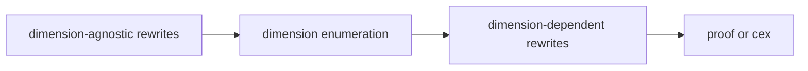
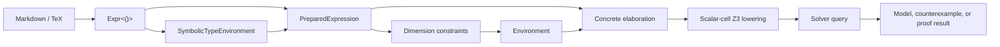

# `linalg-checker`

Lightweight checking for undergraduate-level finite-dimensional linear algebra

<!-- Disclaimer: I am not saying that we should use the code base that I have been working on. This is a prototype. The point is to share what I think I learned from tinkering with it. -->

---

## Original motivation (perhaps naive)

- When people write proofs, they usually assert **universally quantified statements** $\forall n_1, n_2, \dots, x_1, x_2, \dots \,, \phi(n_1, n_2, \dots, x_1, x_2, \dots)$
- **Naively,** I said: "existentially quantified statements are easy to prove! **Just** fuzz and exhibit a witness like software testing folks do"
- Proving student-written claims true is an unsatisfactory solution on its own
  - It costs latency/$$$ to try to **prove falsehoods**

---

<!-- ## Original motivation (naive) -->

- Problem 1: Witnesses involve real numbers?
  - Naive answer: Fuzz over $\mathbb Q$
  - Other answer: Fuzz over the closure of $\mathbb Q$ under $\sqrt \cdot$
- Problem 2: Hypotheses (e.g. equational constraints) will be satisfied w.p. 0?
  - Set of witnesses has measure 0?
  - Fuzzing only checks points

<!-- todo: visualize points floating above/below lower-dimensional manifold -->

---

## Actual motivation

- 100% correctness is not the most important goal in education
  - In fact it is seldom as important a goal as many formal methods researchers wish to believe
<!-- - Disproving is naturally expressed as deciding an **existentially quantified formula** $\exists x_1, x_2, \dots \, \neg\phi(x_1, x_2, \dots)$ -->
- **There will always be "easy" problems** for which symbolic/non-neural algorithms are already **much** cheaper/more responsive than LLMs will ever be
- At the undergrad level, **we are interested in "easy" problems**
  - maybe even decidable!
  - Or translatable or "closely" under/over-approximable by decidable problems
- **What if our system based on SoTA tech is 10 years behind SoTA performance?**

---

## QFRA example: Squaring nonnegative numbers is monotone

Given:

- $x \in \mathbb{R}$
- $y \in \mathbb{R}$
- $0 \le x$
- $x \le y$

WTS $x^{2} \le y^{2}$

✅ verified

This follows from the following facts:

- $0 \le \left(y - x\right) \left(x + y\right)$

1. $0 \le y$

   

   
✅ verified

   This follows from the following facts:

   - $0 \le x$
   - $x \le y$
   

2. $0 \le y - x$

   

   
✅ verified

   This follows from the following facts:

   - $x \le y$
   

3. $0 \le \left(y - x\right) \left(x + y\right)$

   

   
✅ verified

   This follows from the following facts:

   - $0 \le x$
   - $x \le y$
   

4. $0 \le y^{2} - x^{2}$

   

   
✅ verified

   This follows from the following facts:

   - $0 \le \left(y - x\right) \left(x + y\right)$
   

---

## Example w/ dimensions: Orthogonal matrices preserve squared length

Given:

- $U \in \mathbb{R}^{n \times n}$
- $x \in \mathbb{R}^{n}$
- $U^\top U = I$

WTS $\left\lVert U x \right\rVert_{2}^{2} = \left\lVert x \right\rVert_{2}^{2}$

✅ likely

No counterexamples found up to a maximum dimension of 2.

This may follow from the following facts:

- $U^\top U = I$
- $x^\top U^\top U x = x^\top I x$

1. $\left(U x\right)^\top U x = x^\top U^\top U x$

   

   
✅ likely

   No counterexamples found up to a maximum dimension of 2.

   No premises seemed necessary to show this.
   

2. $x^\top U^\top U x = x^\top I x$

   

   
✅ likely

   No counterexamples found up to a maximum dimension of 2.

   This may follow from the following facts:

   - $U^\top U = I$
   

3. $x^\top I x = x^\top x$

   

   
✅ likely

   No counterexamples found up to a maximum dimension of 2.

   No premises seemed necessary to show this.
   

<!-- todo: give the execution time on a 6-core laptop because this is the main difference wrt llm -->

---

## Architecture

Core idea:

---

## Regarding CNL

- Not the core motivation.
- Orthogonal to the SMT-solving/decision procedures aspect of this prototype
- But perhaps independently interesting:
  - Can choice of syntax cut the gordian knot of faithfulness?
    - cosine similarity in embedding space as a poor faithfulness metric. Some directions in embedding space don't correspond to our application-specific notion of similarity?
      - option 1: don't use the embeddings
      - option 2: learn a regression model that predicts faithfulness from embeddings
      - option 3: **eliminate/discourage differences along the irrelevant directions**

---

## What has "wide wall" done for us?

Related: "What has mathlib done for us?"

- The appeal is obvious
  - Without it, we are no better than unusable ITS of prior decades
- The opportunity is obvious
  - LLMs can accept almost any textual input
  - Almost any proposition can be expressed using constructs from mathlib
- **Feasibility**
  - The implementation is here!
    - or at least, it is close? pending library learning?
  - "wide wall" QA/alignment remains aspirational
- **Desirability**: "wide wall" might actually be the **worst thing** about LLM tutors?

---

## Types of guarantees

Solve the following problem:
- **Decide** linear algebra propositions with *bounded dimension* that can be expressed without quantifier alternation
  - i.e.: prove or disprove
- **Disprove** linear algebra propositions that can be expressed without quantifier alternation

---

## Future work

- Generate Lean from linalg-checker IR
  - Graceful handling of unsupported expressions (fall back to alternate path to Lean)

---

## Future work?

- **Decide k-step provability** from finite collection of deduction rules + lemma library
  - BMC-like approach to provability -- not just "use `aesop`"
    - An excuse to work on theory of ADTs + theory combination?
- **Generalize to a framework**
  - related to ongoing library learning work
  - Extension points:
    - syntax: operator library w/ parse rules etc.
    - rewrite library

---

## Future work: partial concretization?

- Potential problem: QFRA could turn out to be slow, e.g. because counterexamples of small dimension may not exist
- idea:
  - if counterexamples of dimension $n$ are a manifold $W$ of dimension $k < n$,
  - and you leave $d$ values symbolic while randomly setting the remaining values randomly,
  - then the $d$-dimensional counterexample candidate space $U$ that the solver searches over
  - may satisfy that $p(U \cap W) \neq 0$
- In other words: concolic testing for math
